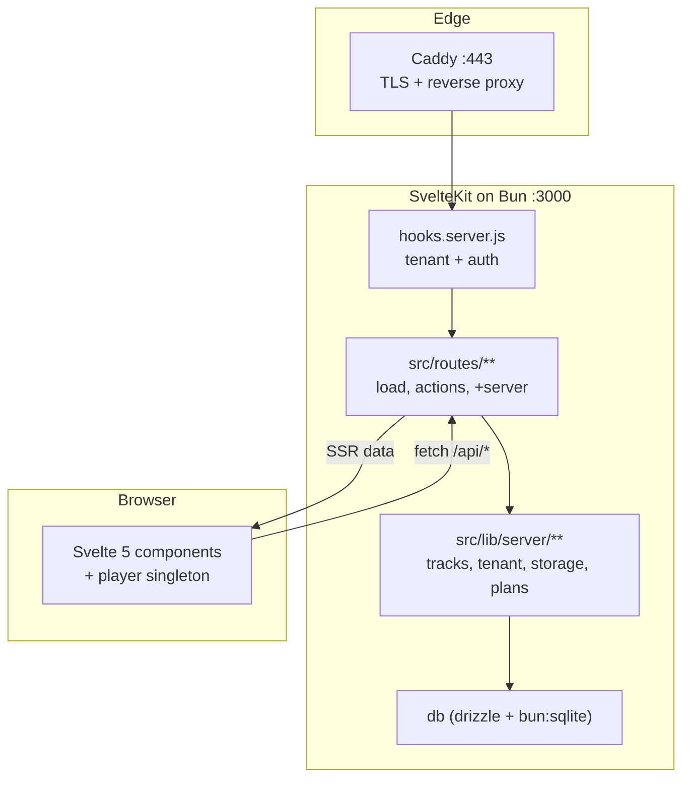
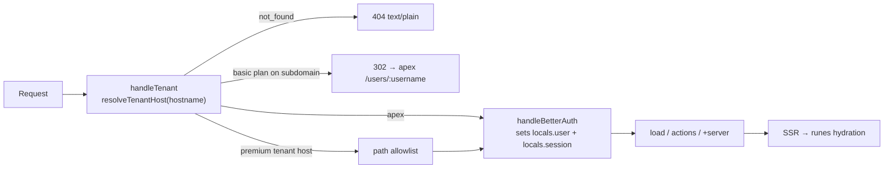

# Architecture

## The shape of the app

Three layers, one direction of dependency:



Routes never touch `db` directly — they call a service module in `src/lib/server/`. Services never
import from `src/routes/`. Components never import from `src/lib/server/`.

## Request lifecycle

`src/hooks.server.js` composes two handles with `sequence()`. Order matters: tenant resolution
runs **before** session lookup, so a 404 for an unknown host costs no auth work.



### `handleTenant`

Skipped entirely when `building`. Otherwise it reads the hostname (preferring `x-forwarded-host`,
which Caddy sets) and resolves it:

| Outcome     | Effect                                                              |
| ----------- | ------------------------------------------------------------------- |
| `apex`      | pass through untouched                                              |
| `not_found` | plain-text 404 response, no SvelteKit render                        |
| `redirect`  | 302 to the apex path URL — a basic-plan user cannot use a subdomain |
| `rewrite`   | sets `event.locals.tenant`, then gates the path                     |

On a tenant host the path allowlist is deliberately narrow:

- **Passthrough:** `/_app`, `/api/auth`, `/favicon.*`, `/robots.txt`
- **404:** `/settings`, `/signin`, `/signup`, `/forgot-password`, `/reset-password`, `/library`,
  `/api/domain-tls-check` — account surfaces only exist on the apex
- **Allowed:** `/`, `/tracks/*`, `/api/media/*`, `/api/tracks/*`
- `/users/{own username}` redirects to `/` so a tenant host has one canonical profile URL

### `handleBetterAuth`

Calls `auth.api.getSession()` and, when a session exists, populates `locals.user` and
`locals.session`. Then delegates to better-auth's `svelteKitHandler`, which owns `/api/auth/*`.

## The `locals` contract

Declared in [`src/app.d.ts`](../src/app.d.ts). All three fields are optional — check before use.

| Field            | Set by             | Meaning                                 |
| ---------------- | ------------------ | --------------------------------------- |
| `locals.user`    | `handleBetterAuth` | signed-in better-auth user              |
| `locals.session` | `handleBetterAuth` | the session row                         |
| `locals.tenant`  | `handleTenant`     | request arrived on a creator's own host |

`locals.tenant` carries `{ userId, username, plan, name, customDomain, customDomainStatus, hostKind }`
where `hostKind` is `'subdomain' | 'custom'`. Its presence is the single signal for "render in
tenant mode": hide the apex site header, drop the footer, serve the profile from `/`.

Only `handleTenant` writes `locals.tenant`. Loaders read it, never set it.

## Tenancy model

One creator, three public URLs, gated by plan ([`src/lib/server/plans.js`](../src/lib/server/plans.js)):

| Surface       | URL                               | Requires                                      |
| ------------- | --------------------------------- | --------------------------------------------- |
| Path          | `{ORIGIN}/users/{username}`       | nothing — always available                    |
| Subdomain     | `{username}.{PUBLIC_BASE_DOMAIN}` | `premium`                                     |
| Custom domain | the creator's own hostname        | `premium` + `customDomainStatus === 'active'` |

`classifyHost()` in [`src/lib/server/tenant.js`](../src/lib/server/tenant.js) decides which is which:

- the base domain, `www.{base}`, `localhost`, `127.0.0.1`, and empty all classify as **apex**
- a single label under the base domain is a **subdomain** — unless it is `www` or a member of
  `RESERVED_USERNAMES`, in which case it falls back to apex so infra hostnames keep working
- anything else is a **custom** hostname, resolved by exact match against `profile.customDomain`

Both the path route and the tenant `/` render from one loader,
[`loadPublicProfilePage()`](../src/lib/server/profile-page.js), so the two surfaces cannot drift.

Custom domains need DNS proof before they go `active`: a TXT record at `_sndbnk-verify.{domain}`
plus a CNAME to `{username}.{base}`. See [`src/lib/server/domain-verify.js`](../src/lib/server/domain-verify.js).
Caddy asks `/api/domain-tls-check` before issuing a certificate for any unknown host, so an
unverified domain cannot mint TLS certs — details in [operations.md](operations.md).

## Directory map

```
src/
  app.html               pre-paint theme script (avoids FOUC)
  app.d.ts               App.Locals declarations
  env.js                 defineEnvVars — the env var registry
  hooks.server.js         tenant + auth handles
  routes/
    +layout.svelte        app shell, theme + accent init, Milkdrop window mount
    layout.css            design tokens + global utilities
    +page.svelte          marketing landing OR tenant profile
    signin/ signup/       auth forms
    forgot-password/      request password reset email
    reset-password/       set new password from emailed token
    settings/             profile (incl. email change), plan, domain, storage (tabbed)
    library/              owner CRUD: list, new, [id] edit
    tracks/[id]/          public track detail
    users/[username]/     public profile by path
    api/                  media streaming, social mutations, TLS check
  lib/
    components/           SiteHeader (hosts the player), ThemeToggle, PublicProfile, player/*
    player/player.svelte.js       rune-class audio singleton
    player/visualizer.svelte.js   Milkdrop (butterchurn) toggle + one-shot Web Audio graph
    stores/               theme, brand (legacy writable stores)
    media/                client-side metadata probe
    server/
      auth.js             better-auth instance
      db/                 schema.js, auth.schema.js (generated), index.js
      tenant.js plans.js username.js domain-verify.js profile-page.js
      tracks.js           track CRUD + serialization
      social.js           follow graph, reposts, profile stats
      media/              waveform.js (ffmpeg), embed-tags.js (taglib)
      storage/            adapter interface, local, ssh, crypto
      safe-redirect.js    adapter-safe redirect
drizzle/                        Drizzle SQL migrations + meta snapshots
scripts/migrate-sqlite.js       Bun-native migrate + seeds
scripts/backup-sqlite.js        SQLite file backup before prod applies
```

## Conventions that hold across layers

- **Service modules return result objects.** Validation and mutation helpers return
  `{ ok: true, ... } | { ok: false, message }`. They do not throw for anything a user could cause.
  Throwing is reserved for programmer error and missing configuration.
- **The boundary converts results to HTTP.** `fail()` for form validation, `error()` for missing
  resources and unauthorized API calls, `safeRedirect()` for navigation.
- **Ownership is checked at the query.** `getOwnedTrack(userId, trackId)` for anything mutating,
  `getTrackById(trackId)` for public reads. There is no separate authorization layer to forget.
- **Media side effects fail soft.** Waveform generation and tag embedding return `null` or
  `{ ok: false }` rather than aborting an upload that already succeeded.
- **Env access goes through `$app/env/private` and `$app/env/public`**, declared in
  [`src/env.js`](../src/env.js). `process.env` appears only in build-time config and scripts.
