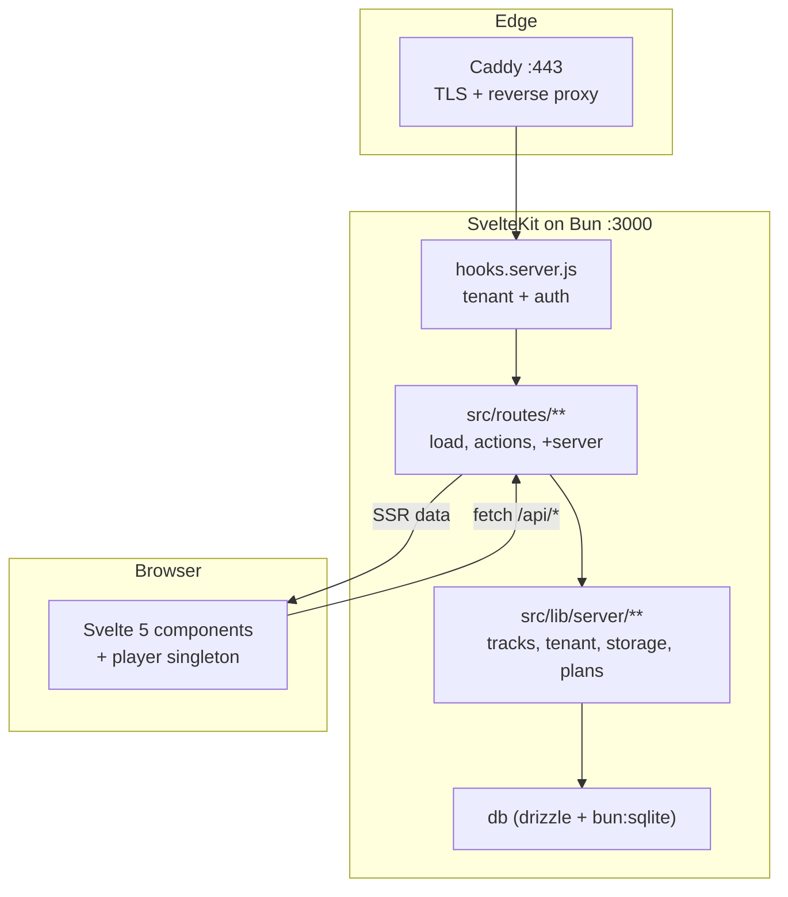
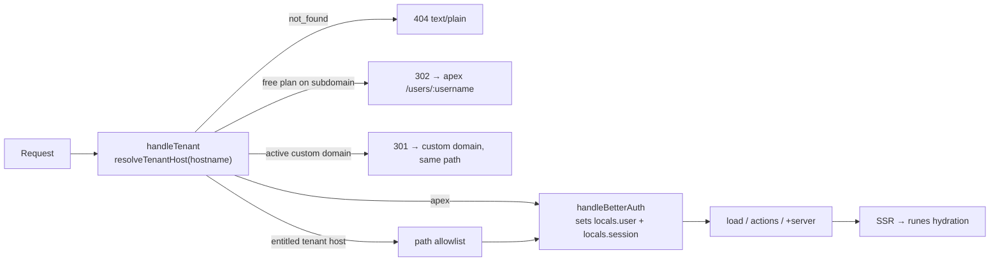

# Architecture

## The shape of the app

Three layers, one direction of dependency:


```mermaid
flowchart TD
  subgraph edge [Edge]
    caddy["Caddy :443<br/>TLS + reverse proxy"]
  end
  subgraph app [SvelteKit on Bun :3000]
    hooks["hooks.server.js<br/>tenant + auth"]
    routes["src/routes/**<br/>load, actions, +server"]
    services["src/lib/server/**<br/>tracks, tenant, storage, plans"]
    dbc["db (drizzle + bun:sqlite)"]
  end
  subgraph client [Browser]
    runes["Svelte 5 components<br/>+ player singleton"]
  end

  caddy --> hooks --> routes
  routes --> services --> dbc
  routes -->|"SSR data"| runes
  runes -->|"fetch /api/*"| routes
```

Routes are meant to call a service in `src/lib/server/` and not query `db`. Settings, admin, the
sitemap, the Stripe webhook, and the track like and comment POST handlers still do. Services never
import from `src/routes/`. Components never import from `src/lib/server/`.

## Request lifecycle

`src/hooks.server.js` composes two handles with `sequence()`. Order matters: tenant resolution
runs **before** session lookup, so a 404 for an unknown host costs no auth work.


```mermaid
flowchart LR
  req[Request] --> tenant["handleTenant<br/>resolveTenantHost(hostname)"]
  tenant -->|apex| authHook
  tenant -->|not_found| nf["404 text/plain"]
  tenant -->|"free plan on subdomain"| redir["302 → apex /users/:username"]
  tenant -->|"active custom domain"| canon["301 → custom domain, same path"]
  tenant -->|"entitled tenant host"| gate["path allowlist"]
  gate --> authHook["handleBetterAuth<br/>sets locals.user + locals.session"]
  authHook --> handler["load / actions / +server"]
  handler --> render["SSR → runes hydration"]
```

### `handleTenant`

Skipped entirely when `building`. Otherwise it reads the hostname (preferring `x-forwarded-host`,
which Caddy sets) and resolves it:

| Outcome     | Effect                                                                                                                                                                                      |
| ----------- | ------------------------------------------------------------------------------------------------------------------------------------------------------------------------------------------- |
| `apex`      | pass through untouched                                                                                                                                                                      |
| `not_found` | plain-text 404 response, no SvelteKit render                                                                                                                                                |
| `redirect`  | 302 to the apex path URL when Free cannot use a subdomain (Vault+). 301 to the custom domain, same path and query, when that domain is `active` — the subdomain is not a second public copy |
| `rewrite`   | sets `event.locals.tenant`, then gates the path                                                                                                                                             |

On a tenant host platform and account routes stay deliberately narrow:

- **Passthrough:** `/_app`, `/api/auth`, `/favicon.ico`, `/favicon.png`, `/robots.txt`
- **404:** `/settings`, `/reset-password`, `/feed`, `/library`, `/sites`, `/plans`, `/for-artists`,
  `/vault`, `/studio`, `/admin`, `/dev`, `/privacy`, `/terms`, `/copyright`, `/billing`,
  `/sitemap.xml`, `/users/*`, and any `/api/*` not listed below. `/signin`, `/signup`, and
  `/forgot-password` are apex-only too, except on a custom domain (next bullet)
- **Custom-domain auth:** those three auth pages, plus `/signout`, resolve when `hostKind` is
  `custom`. Sign-in, sign-up, and forgot-password 404 unless `site.allowDomainAuth` is on.
  `/signout` still clears the session after that switch is turned off. Subdomains 404 all four
- **Network session:** `/auth/network` (in `TENANT_ALLOWED_PREFIXES`) copies the same better-auth
  session between the custom domain and the apex with a single-use code. Browsers will not send a
  `sndbnk.com` cookie to another host
- **Platform public:** `/{username}/tracks/{slug}/`, `/tracks/*` (legacy UUID 301), `/playlists/*`,
  `/api/media/*`, `/api/avatar/*`, `/api/site-logo/*`, `/api/site-og/*`, `/api/site-media/*`,
  `/api/tracks/*`, `/api/playlists/*`, `/api/users/*`, `/api/site-views`
- **Composed site:** `/` and flat `site_page` paths such as `/about`; the catch-all loader returns
  404 when no page has that exact path
- `/users/{own username}` redirects to `/` so a tenant host has one canonical profile URL

### `handleBetterAuth`

Calls `auth.api.getSession()` and, when a session exists, populates `locals.user` and
`locals.session`. Then delegates to better-auth's `svelteKitHandler`, which owns `/api/auth/*`.

## The `locals` contract

Declared in [`src/app.d.ts`](../src/app.d.ts). All three fields are optional — check before use.

| Field            | Set by             | Meaning                                 |
| ---------------- | ------------------ | --------------------------------------- |
| `locals.user`    | `handleBetterAuth` | signed-in better-auth user              |
| `locals.session` | `handleBetterAuth` | the session row                         |
| `locals.tenant`  | `handleTenant`     | request arrived on a creator's own host |

`locals.tenant` carries `{ userId, username, plan, name, customDomain, customDomainStatus, hostKind }`
where `hostKind` is `'subdomain' | 'custom'`. Its presence is the single signal for "render in
tenant mode": hide apex chrome, resolve `/` or a flat path through
[`loadTenantSitePage()`](../src/lib/server/site-page-public.js), and apply `site` branding (name,
logo, accent, appearance `light`/`dark`/`user`, theme persona, navbar/footer accents). A
`catalog.profile` or `catalog.stream` block loads the creator's live profile through
[`loadPublicProfilePage()`](../src/lib/server/profile-page.js). Locked tenant appearance overrides
the listener theme preference; `user` resolves from site-scoped localStorage (or system).

Only `handleTenant` writes `locals.tenant`. Loaders read it, never set it.

## Tenancy model

One creator, three public URLs, gated by plan entitlements
([`src/lib/server/billing/plans.js`](../src/lib/server/billing/plans.js)):

| Surface       | URL                               | Requires                                                                                    |
| ------------- | --------------------------------- | ------------------------------------------------------------------------------------------- |
| Path          | `{ORIGIN}/users/{username}`       | nothing — always available                                                                  |
| Subdomain     | `{username}.{PUBLIC_BASE_DOMAIN}` | `allowSubdomain` (Vault+). While a custom domain is `active`, this host 301s to that domain |
| Custom domain | the creator's own hostname        | `allowCustomDomain` (Studio+) + `customDomainStatus === 'active'`                           |

`classifyHost()` in [`src/lib/server/tenant.js`](../src/lib/server/tenant.js) decides which is which:

- the base domain, `www.{base}`, `localhost`, `127.0.0.1`, and empty all classify as **apex**
- a single label under the base domain is a **subdomain** — unless it is `www` or a member of
  `RESERVED_USERNAMES`, in which case it falls back to apex so infra hostnames keep working
- anything else is a **custom** hostname, resolved against `profile.customDomain` (with
  `example.com` ↔ `www.example.com` pairing for simple apex names)

The apex path route remains the standalone audio profile. Tenant hosts render persisted site chrome
and visible `site_page` blocks (`hidden` blocks stay in the page list and are omitted); artists place
`catalog.profile` wherever the live profile/catalog should appear. An `active` custom domain is the only public tenant host: `{username}.{base}` answers with
a 301 to that hostname (path and query preserved, `Cache-Control: no-store` so removing the domain
lets the subdomain serve again). The subdomain stays the DNS target for CNAME and TLS.

Custom domains need DNS proof before they go `active`: a TXT record at `_sndbnk-verify.{domain}`
plus either a CNAME (or CNAME chain) to `{username}.{base}`, or A/AAAA addresses that match the
platform edge (the resolved addresses of that subdomain, falling back to the apex). Apex domains
typically use A/AAAA or ALIAS/ANAME because DNS forbids CNAME at the zone apex. See
[`src/lib/server/domain-verify.js`](../src/lib/server/domain-verify.js).
Caddy asks `/api/domain-tls-check` before issuing a certificate for any unknown host, so an
unverified domain cannot mint TLS certs — details in [operations.md](operations.md).

An active custom domain also keeps first-party audience counts
([`site-analytics.js`](../src/lib/server/site-analytics.js)): HTML page loads (plus the referring
hostname), later in-site navigations, and qualified plays. There is no analytics cookie and no
unique-visitor figure. The owner reads them at Settings → Audience. Vault subdomains and the apex
profile are not counted.

## Directory map

```
src/
  app.html               pre-paint theme script (avoids FOUC)
  app.d.ts               App.Locals declarations
  env.js                 defineEnvVars — the env var registry
  hooks.server.js         tenant + auth handles
  routes/
    +layout.svelte        app shell, theme + accent init, visualizer floating window mount
    layout.css            design tokens + global utilities
    +page.svelte          marketing landing OR composed tenant site (`mode: 'tenant-site'`)
    signin/ signup/       auth forms; branded on a custom domain when allowDomainAuth
    forgot-password/      request password reset email
    reset-password/       set new password from emailed token (apex only)
    signout/              form action signs out; custom domains also clear the apex cookie
    auth/network/         one-time session copy between apex and a custom domain
    feed/                 signed-in timeline
    library/              owner file manager; deck edit is ?track= + ?edit=1
    library/new/ [id]/    redirects into that deck
    [username]/tracks/[slug]/  public track detail (+ /embed)
    tracks/[id]/          301 to the slug URL
    playlists/            public playlist, new, edit
    users/[username]/     public profile by path
    plans/ billing/return/ Stripe checkout and the return page
    settings/             profile, linked accounts, billing, domain, site, audience, storage
    sites/[id]/           setup wizard; sites/[id]/builder is the site builder
    for-artists/ vault/ studio/ marketing funnels (apex)
    admin/                staff plans, users, play thresholds, HTML docs
    api/                  media, social, billing, health, TLS check
  lib/
    components/           SiteHeader (hosts the player), ThemeToggle, PublicProfile, player/*
    player/player.svelte.js       rune-class audio singleton
    player/visualizer.svelte.js   visualizer toggle, inline/window mode, Web Audio graph
    stores/               theme, brand (legacy writable stores)
    media/                client-side metadata probe
    server/
      auth.js             better-auth instance (+ multi-session, linked-account switch)
      domain-auth.js      custom-domain sign-in, session handoff, site accounts
      auth-linked-switch.js  trusted switch between mutually linked accounts
      account-links.js    request / approve / unlink moniker accounts
      db/                 schema.js, auth.schema.js (generated), index.js
      tenant.js billing/plans.js username.js domain-verify.js profile-page.js
      site.js             tenant branding (accent/appearance/persona) + site chrome (header/footer)
      site-analytics.js   custom-domain page loads, referrers, plays, signed-in listeners
      site-pages.js       CMS pages + body block lists for the site builder
      tracks.js           track CRUD + serialization
      social.js           follow graph, reposts, profile stats
      media/              waveform.js (ffmpeg peaks), transcode.js (playback MP3), embed-tags.js (taglib)
      queue/              BullMQ waveform + transcode + embed-tags jobs (Redis); worker: bun run worker:waveform
      storage/            adapter interface, local, platform s3 (sndbnk-media in prod), ssh BYOS, crypto
      safe-redirect.js    adapter-safe redirect
drizzle/                        Drizzle SQL migrations + meta snapshots
scripts/migrate-sqlite.js       Bun-native migrate + seeds
scripts/backup-sqlite.js        SQLite file backup before prod applies
```

## Conventions that hold across layers

- **Service modules return result objects.** Validation and mutation helpers return
  `{ ok: true, ... } | { ok: false, message }`. They do not throw for anything a user could cause.
  Throwing is reserved for programmer error and missing configuration.
- **The boundary converts results to HTTP.** `fail()` for form validation, `error()` for missing
  resources and unauthorized API calls, `safeRedirect()` for navigation.
- **Ownership is checked at the query.** `getOwnedTrack(userId, trackId)` for anything mutating,
  `getTrackById(trackId)` for public reads. There is no separate authorization layer to forget.
- **Media side effects fail soft.** Waveform generation, playback-MP3 transcode, and tag embedding return
  `null` or `{ ok: false }` rather than aborting an upload or track save that already succeeded.
  Write-tags is queued on the same worker; the save returns immediately with `queued` / `failed`.
- **Env access goes through `$app/env/private` and `$app/env/public`**, declared in
  [`src/env.js`](../src/env.js). `process.env` appears only in build-time config and scripts.
