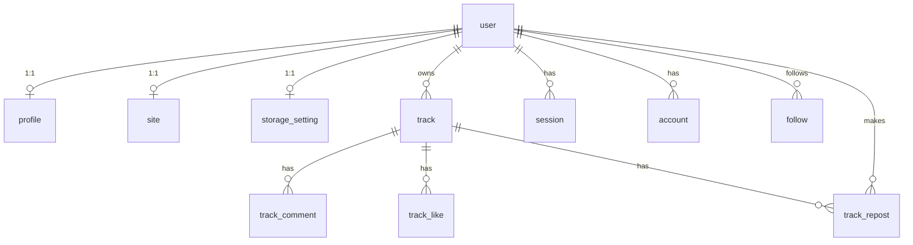

# Data model

SQLite through Drizzle, opened with Bun's native driver. One client, exported once:

```js
// src/lib/server/db/index.js
export const db = drizzle(DATABASE_URL, { schema });
```

`DATABASE_URL` is a **filesystem path** (`local.db`), not a connection string. The module throws at
import time if it is missing, so a misconfigured deploy fails immediately rather than on first query.

Import tables from `#lib/server/db/schema` — it re-exports the auth tables, so one import covers
everything.

## Naming

| Layer       | Case                | Example                  |
| ----------- | ------------------- | ------------------------ |
| JS property | camelCase           | `customDomainStatus`     |
| SQL column  | snake_case          | `custom_domain_status`   |
| Table name  | singular snake_case | `track`, `track_comment` |

Always pass the snake_case name explicitly as the column-builder argument:
`customDomain: text('custom_domain')`. Never rely on inference.

## Column conventions

```js
id: text('id').primaryKey().$defaultFn(() => crypto.randomUUID()),
createdAt: integer('created_at', { mode: 'timestamp_ms' }).$defaultFn(() => new Date()).notNull(),
updatedAt: integer('updated_at', { mode: 'timestamp_ms' })
	.$defaultFn(() => new Date())
	.$onUpdate(() => new Date())
	.notNull()
```

- **IDs** are `text` UUIDs from `crypto.randomUUID()`, generated in JS, not by SQLite.
- **Timestamps** are `integer` with `mode: 'timestamp_ms'`, so Drizzle hands you a `Date`. Serialize
  to `.getTime()` at the route boundary — never ship a `Date` to the client.
- **Booleans** are `integer` with `mode: 'boolean'`.
- **Every user-owned row cascades**: `.references(() => user.id, { onDelete: 'cascade' })`. Deleting
  a user removes their profile, storage setting, tracks, comments, and likes with no cleanup code.
- **Enums are `text` plus a JSDoc typedef**, not a SQL constraint:
  `/** @typedef {'free' | 'vault' | 'studio' | 'label'} Plan */`. Entitlement helpers live in
  ([`billing/plans.js`](../src/lib/server/billing/plans.js)).

## Tables

### Auth — generated, do not edit

[`src/lib/server/db/auth.schema.js`](../src/lib/server/db/auth.schema.js) is written by the
better-auth CLI. Regenerate with `bun run auth:schema`; hand edits are lost. The CLI emits double
quotes and spaces, so **follow it with `bun run format`** or the file will fail lint.

| Table          | Notes                                                                     |
| -------------- | ------------------------------------------------------------------------- |
| `user`         | `id`, `name`, `email` (unique), `emailVerified`, `image`, timestamps      |
| `session`      | `token` (unique), `expiresAt`, `ipAddress`, `userAgent`, `userId` → index |
| `account`      | credential + OAuth fields; `password` hash lives here, not on `user`      |
| `verification` | `identifier` → index, `value`, `expiresAt`                                |

These tables have no `$defaultFn` on IDs or timestamps — better-auth supplies them.

### `profile` — one per user, created at signup

`userId` is both primary key and foreign key, so the 1:1 relationship is enforced by the schema.

| Column                                     | Purpose                                                    |
| ------------------------------------------ | ---------------------------------------------------------- |
| `username`                                 | unique; the subdomain label and path segment               |
| `plan`                                     | `'free' \| 'vault' \| 'studio' \| 'label'`, default `free` |
| `customDomain`                             | unique, nullable; apex↔`www` paired at lookup time         |
| `customDomainStatus`                       | `'none' \| 'pending' \| 'active'`                          |
| `domainVerifyToken`                        | the `sndbnk-verify=…` value the owner puts in DNS TXT      |
| `customDomainVerifiedAt`                   | timestamp of the last successful verification              |
| `stripeCustomerId`, `stripeSubscriptionId` | Stripe customer / active subscription ids                  |
| `planInterval`, `subscriptionStatus`, …    | billing interval, Stripe status, or `grandfathered`        |

A user without a `profile` row is in a broken half-registered state. Loaders that need one
redirect to `/signup` rather than rendering.

### `site` — optional 1:1 tenant branding

Keyed on `userId`, lazy-created on first Settings → Site save. Missing row means fall back to
profile name / bio / avatar and SNDBNK defaults. Applied on subdomain and custom-domain hosts only;
apex `/users/{username}` ignores it.

| Column                            | Purpose                                                           |
| --------------------------------- | ----------------------------------------------------------------- |
| `name` / `description`            | Tenant title and meta description                                 |
| `logoFilename` / `logoMime`       | Local-disk logo (`site-logo/`); also used as favicon when set     |
| `ogImageFilename` / `ogImageMime` | Social share image (`site-og/`); falls back to logo then avatar   |
| `accentColor`                     | `#RRGGBB` tenant accent; null keeps listener/default accent       |
| `hideBranding`                    | Hide “Powered by SNDBNK”; honored only when `allowRemoveBranding` |
| `sidebarEnabled`                  | Master toggle for profile sidebar on **custom domains** only      |
| `sidebarStats`                    | Stats card (counts, Follow, reposts); default on                  |
| `sidebarFansAlsoLike`             | Fans Also Like card; default on                                   |
| `sidebarFollowers`                | Followers card; default on                                        |
| `sidebarActivity`                 | Last Comments card; default on                                    |

Sidebar defaults: master off, cards on (so enabling the master restores a full sidebar). Apex and
subdomain hosts ignore these flags. `resolveSidebarVisibility()` in
[`site.js`](../src/lib/server/site.js) resolves them for the profile loader.

Service: [`site.js`](../src/lib/server/site.js). Public files: `/api/site-logo/[userId]`,
`/api/site-og/[userId]`. Edit gate: Vault+ (`canUseSubdomain`) or Studio+ (`canUseCustomDomain`);
`hideBranding` needs Studio+ (`canRemoveBranding`); sidebar toggles need Studio+
(`canUseCustomDomain`).

### `plan` — entitlement catalog

Seeded by [`scripts/migrate-sqlite.js`](../scripts/migrate-sqlite.js) as Free / Vault / Studio /
Label. Admin edits copy, prices, and flags; Stripe price ids are filled by
`bun run stripe:bootstrap`.

| Column                                      | Purpose                                                        |
| ------------------------------------------- | -------------------------------------------------------------- |
| `maxTracks` / `maxLocalBytes`               | Caps (`null` = unlimited). Bytes meter **local** adapter only. |
| `allowStorageAdapters`                      | BYO (SSH today; S3/R2 later) — true on every seeded tier       |
| `allowSubdomain`                            | Vault+                                                         |
| `allowCustomDomain` / `allowRemoveBranding` | Studio+                                                        |
| `maxTeamSeats`                              | Label team seats (UI not built yet)                            |
| `monthlyAmount` / `yearlyAmount`            | Display cents; Stripe remains charging authority               |

Helpers: `canUseSubdomain`, `canUseCustomDomain`, `canUseStorageAdapters`, `canRemoveBranding`,
`hasTeamSeats` in [`billing/plans.js`](../src/lib/server/billing/plans.js). Site edit gate lives in
`canEditSite` ([`site.js`](../src/lib/server/site.js)).

### `storage_setting` — one per user, lazily created

Also keyed on `userId`. `getOrCreateStorageSetting()` inserts a default `local` row on first read,
so callers never handle a missing row. SSH credentials are stored in `sshPrivateKeyEnc` /
`sshPassphraseEnc` as AES-256-GCM blobs — see [media-and-storage.md](media-and-storage.md).

### `track`

Four groups of columns:

| Group               | Columns                                                                                                        |
| ------------------- | -------------------------------------------------------------------------------------------------------------- |
| Editable metadata   | `title` (required), `description`, `artist`, `album`, `genre`, `year`, `trackNumber`, `bpm`, `isrc`, `comment` |
| Files               | `audioFilename`, `audioMime`, `audioBytes`, `coverFilename`, `coverMime`, `coverBytes`                         |
| Probed technical    | `durationMs`, `bitrate`, `sampleRate`, `channels`, `codec`                                                     |
| Derived / placement | `waveform` (JSON string of ~1000 ints), `published`, `storageAdapter`, `folderKey`                             |

`storageAdapter` is a **snapshot of the owner's adapter at upload time**, and `folderKey` equals the
track `id`. Reads pass the stored value back in — `getStorageAdapter(userId, row.storageAdapter)` —
so switching your storage setting never orphans existing tracks.

`published` defaults to `1`. Public surfaces — profile pages, the feed, the landing hero, and
`/tracks/[id]` for anyone but the owner — filter on it; the owner's library lists every track and
carries the toggle.

### `track_comment`

`atMs` optionally pins a comment to a playback position, which is what makes timeline comments
work. Indexed on `trackId`.

### `track_like`

Composite primary key `(trackId, userId)`, so the "one like per user" rule is a schema guarantee and
the toggle endpoint needs no uniqueness check.

### `track_repost`

Same shape as `track_like` — composite primary key `(trackId, userId)` plus a
`(userId, createdAt)` index, because reposts are read back in reverse-chronological order for a
profile listing and for the Following feed. `createdAt` is the repost time, which is what a reposted
track sorts by; the track's own `createdAt` is ignored for placement. Reposting your own track is
rejected in `toggleRepost()`, not by a constraint.

### `follow`

Composite primary key `(followerId, followingId)` and an index on `followingId` for follower counts.
Self-follow is rejected in `toggleFollow()` with a result object, per the no-exceptions rule.

## Relations



Drizzle `relations()` are declared for every table but the code overwhelmingly uses explicit
`select().innerJoin()` with a projection object instead of the relational query API. Follow that:
selecting named columns keeps the wire payload honest and makes the joined shape obvious at the
call site.

```js
const rows = await db
	.select({ userId: profile.userId, username: profile.username, name: user.name })
	.from(profile)
	.innerJoin(user, eq(profile.userId, user.id))
	.where(eq(profile.username, username))
	.limit(1);

return rows[0] ?? null;
```

Single-row lookups always `.limit(1)` and return `rows[0] ?? null`. Callers decide whether `null`
means 404, redirect, or lazy create.

## Query patterns

- **Ownership gate for mutations.** `getOwnedTrack(userId, trackId)` filters on both columns; there
  is no "fetch then compare" step to forget.
- **Public reads are separate functions.** `getTrackById`, `getTrackWithUploader`,
  `listTracksWithUploader` — no viewer identity required.
- **Batch the social counts.** `getSocialForTracks(trackIds, viewerId)` returns a
  `Map<trackId, { likeCount, commentCount, likedByViewer }>` so a profile page with 40 tracks does
  not fire 40 queries. Add new per-track aggregates to that map rather than looping.

## Changing the schema

sndbnk uses **Drizzle Kit generate + migrate** (codebase-first). The human-facing walkthrough is the
standalone page [`docs/drizzle-migrations.html`](drizzle-migrations.html).

1. Edit [`src/lib/server/db/schema.js`](../src/lib/server/db/schema.js) (auth tables: regenerate with
   `bun run auth:schema && bun run format` first).
2. `bun run db:generate` — writes SQL under [`drizzle/`](../drizzle/) plus a snapshot in
   `drizzle/meta/`. Commit those files with the schema change.
3. **Review the SQL.** Renames may show up as drop+add; `NOT NULL` without a default fails on SQLite
   for existing rows.
4. Apply locally: `bun run db:migrate`.
5. Verify: `bun run dev` and exercise the affected surface.

Production deploy runs `bun run db:backup` (when the DB file exists) then `bun run db:migrate` before
build/restart.

### Why migrate is a Bun script

`drizzle-kit migrate` / `push` / `studio` load `better-sqlite3`, which Bun cannot open. Generate still
uses Drizzle Kit; apply uses [`scripts/migrate-sqlite.js`](../scripts/migrate-sqlite.js) and
`drizzle-orm/bun-sqlite/migrator`. `bun run db:push:kit` and `bun run db:studio` run the Kit CLI
under Node for local prototyping / browsing. The old hand-written
[`scripts/push-sqlite-schema.js`](../scripts/push-sqlite-schema.js) is retired and exits with
instructions.

Existing databases created before `drizzle/` existed are cut over automatically: if app tables are
present and `__drizzle_migrations` is empty, the migrate script records `0000_baseline` as applied
without re-running its `CREATE TABLE` statements, then applies any newer migrations.

### Adding a column

Prefer nullable columns (or supply a `DEFAULT`). SQLite's `ADD COLUMN` cannot add `NOT NULL` without
a default on a table that already has rows. Generate the migration, read the `ALTER TABLE`, migrate
locally, then ship.
