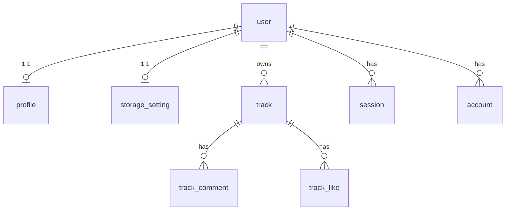

# Data model

SQLite through Drizzle, opened with Bun's native driver. One client, exported once:

```js
// src/lib/server/db/index.js
export const db = drizzle(DATABASE_URL, { schema });
```

`DATABASE_URL` is a **filesystem path** (`local.db`), not a connection string. The module throws at
import time if it is missing, so a misconfigured deploy fails immediately rather than on first query.

Import tables from `#lib/server/db/schema` — it re-exports the auth tables, so one import covers
everything.

## Naming

| Layer       | Case                | Example                  |
| ----------- | ------------------- | ------------------------ |
| JS property | camelCase           | `customDomainStatus`     |
| SQL column  | snake_case          | `custom_domain_status`   |
| Table name  | singular snake_case | `track`, `track_comment` |

Always pass the snake_case name explicitly as the column-builder argument:
`customDomain: text('custom_domain')`. Never rely on inference.

## Column conventions

```js
id: text('id').primaryKey().$defaultFn(() => crypto.randomUUID()),
createdAt: integer('created_at', { mode: 'timestamp_ms' }).$defaultFn(() => new Date()).notNull(),
updatedAt: integer('updated_at', { mode: 'timestamp_ms' })
	.$defaultFn(() => new Date())
	.$onUpdate(() => new Date())
	.notNull()
```

- **IDs** are `text` UUIDs from `crypto.randomUUID()`, generated in JS, not by SQLite.
- **Timestamps** are `integer` with `mode: 'timestamp_ms'`, so Drizzle hands you a `Date`. Serialize
  to `.getTime()` at the route boundary — never ship a `Date` to the client.
- **Booleans** are `integer` with `mode: 'boolean'`.
- **Every user-owned row cascades**: `.references(() => user.id, { onDelete: 'cascade' })`. Deleting
  a user removes their profile, storage setting, tracks, comments, and likes with no cleanup code.
- **Enums are `text` plus a JSDoc typedef**, not a SQL constraint:
  `/** @typedef {'basic' | 'premium'} Plan */`. Validation lives in code
  ([`plans.js`](../src/lib/server/plans.js)), which keeps SQLite migrations trivial.

## Tables

### Auth — generated, do not edit

[`src/lib/server/db/auth.schema.js`](../src/lib/server/db/auth.schema.js) is written by the
better-auth CLI. Regenerate with `bun run auth:schema`; hand edits are lost. The CLI emits double
quotes and spaces, so **follow it with `bun run format`** or the file will fail lint.

| Table          | Notes                                                                     |
| -------------- | ------------------------------------------------------------------------- |
| `user`         | `id`, `name`, `email` (unique), `emailVerified`, `image`, timestamps      |
| `session`      | `token` (unique), `expiresAt`, `ipAddress`, `userAgent`, `userId` → index |
| `account`      | credential + OAuth fields; `password` hash lives here, not on `user`      |
| `verification` | `identifier` → index, `value`, `expiresAt`                                |

These tables have no `$defaultFn` on IDs or timestamps — better-auth supplies them.

### `profile` — one per user, created at signup

`userId` is both primary key and foreign key, so the 1:1 relationship is enforced by the schema.

| Column                                     | Purpose                                               |
| ------------------------------------------ | ----------------------------------------------------- |
| `username`                                 | unique; the subdomain label and path segment          |
| `plan`                                     | `'basic' \| 'premium'`, default `basic`               |
| `customDomain`                             | unique, nullable                                      |
| `customDomainStatus`                       | `'none' \| 'pending' \| 'active'`                     |
| `domainVerifyToken`                        | the `sndbnk-verify=…` value the owner puts in DNS TXT |
| `customDomainVerifiedAt`                   | timestamp of the last successful verification         |
| `stripeCustomerId`, `stripeSubscriptionId` | reserved; billing is not wired up yet                 |

A user without a `profile` row is in a broken half-registered state. Loaders that need one
redirect to `/signup` rather than rendering.

### `storage_setting` — one per user, lazily created

Also keyed on `userId`. `getOrCreateStorageSetting()` inserts a default `local` row on first read,
so callers never handle a missing row. SSH credentials are stored in `sshPrivateKeyEnc` /
`sshPassphraseEnc` as AES-256-GCM blobs — see [media-and-storage.md](media-and-storage.md).

### `track`

Four groups of columns:

| Group               | Columns                                                                                                        |
| ------------------- | -------------------------------------------------------------------------------------------------------------- |
| Editable metadata   | `title` (required), `description`, `artist`, `album`, `genre`, `year`, `trackNumber`, `bpm`, `isrc`, `comment` |
| Files               | `audioFilename`, `audioMime`, `audioBytes`, `coverFilename`, `coverMime`, `coverBytes`                         |
| Probed technical    | `durationMs`, `bitrate`, `sampleRate`, `channels`, `codec`                                                     |
| Derived / placement | `waveform` (JSON string of ~1000 ints), `storageAdapter`, `folderKey`                                          |

`storageAdapter` is a **snapshot of the owner's adapter at upload time**, and `folderKey` equals the
track `id`. Reads pass the stored value back in — `getStorageAdapter(userId, row.storageAdapter)` —
so switching your storage setting never orphans existing tracks.

### `track_comment`

`atMs` optionally pins a comment to a playback position, which is what makes timeline comments
work. Indexed on `trackId`.

### `track_like`

Composite primary key `(trackId, userId)`, so the "one like per user" rule is a schema guarantee and
the toggle endpoint needs no uniqueness check.

## Relations



Drizzle `relations()` are declared for every table but the code overwhelmingly uses explicit
`select().innerJoin()` with a projection object instead of the relational query API. Follow that:
selecting named columns keeps the wire payload honest and makes the joined shape obvious at the
call site.

```js
const rows = await db
	.select({ userId: profile.userId, username: profile.username, name: user.name })
	.from(profile)
	.innerJoin(user, eq(profile.userId, user.id))
	.where(eq(profile.username, username))
	.limit(1);

return rows[0] ?? null;
```

Single-row lookups always `.limit(1)` and return `rows[0] ?? null`. Callers decide whether `null`
means 404, redirect, or lazy create.

## Query patterns

- **Ownership gate for mutations.** `getOwnedTrack(userId, trackId)` filters on both columns; there
  is no "fetch then compare" step to forget.
- **Public reads are separate functions.** `getTrackById`, `getTrackWithUploader`,
  `listTracksWithUploader` — no viewer identity required.
- **Batch the social counts.** `getSocialForTracks(trackIds, viewerId)` returns a
  `Map<trackId, { likeCount, commentCount, likedByViewer }>` so a profile page with 40 tracks does
  not fire 40 queries. Add new per-track aggregates to that map rather than looping.

## Changing the schema

1. Edit [`src/lib/server/db/schema.js`](../src/lib/server/db/schema.js).
2. **Also edit [`scripts/push-sqlite-schema.js`](../scripts/push-sqlite-schema.js)** — this is the
   easy step to miss, and missing it breaks production. New table → add a
   `CREATE TABLE IF NOT EXISTS`. New column → add it to the `CREATE TABLE` **and** to the matching
   `ensureColumns()` call.
3. Apply locally: `bun run db:push`.
4. Verify: `bun run dev` and exercise the affected surface.

### Why there are two schema sources

`drizzle-kit push` loads `better-sqlite3`, which Bun cannot open, so this project ships a
hand-written DDL script that uses `bun:sqlite` directly. `bun run db:push` runs that script, and so
does the production deploy. There is no `drizzle/` migration folder; `db:generate` / `db:migrate` /
`db:studio` exist in `package.json` but have never been used. `bun run db:push:kit` runs
`drizzle-kit push` under Node as a local escape hatch.

So the push script is the migration system, and it has to handle both a fresh database and an
existing one.

### Adding a column to an existing table

`CREATE TABLE IF NOT EXISTS` is a no-op against a table that already exists, so it will never add a
column. That is what `ensureColumns()` is for — it reads `pragma_table_info` and issues
`ALTER TABLE … ADD COLUMN` only for what is missing, which makes it safe to re-run on every deploy:

```js
function ensureColumns(table, columns) {
	const existing = new Set(
		db
			.query(`SELECT name FROM pragma_table_info('${table}')`)
			.all()
			.map((row) => row.name)
	);

	for (const [name, typeSql] of columns) {
		if (existing.has(name)) continue;
		db.exec(`ALTER TABLE ${table} ADD COLUMN ${name} ${typeSql}`);
		console.log(`Added column ${table}.${name}`);
	}
}
```

A new column therefore needs **two** edits in the script: the `CREATE TABLE` body, so fresh databases
get it, and the `ensureColumns()` list, so existing ones do. Adding it to only one is the failure
mode that shipped a broken production schema once already.

SQLite's `ADD COLUMN` cannot add a `NOT NULL` column without a default, so prefer nullable columns
or supply a default.
