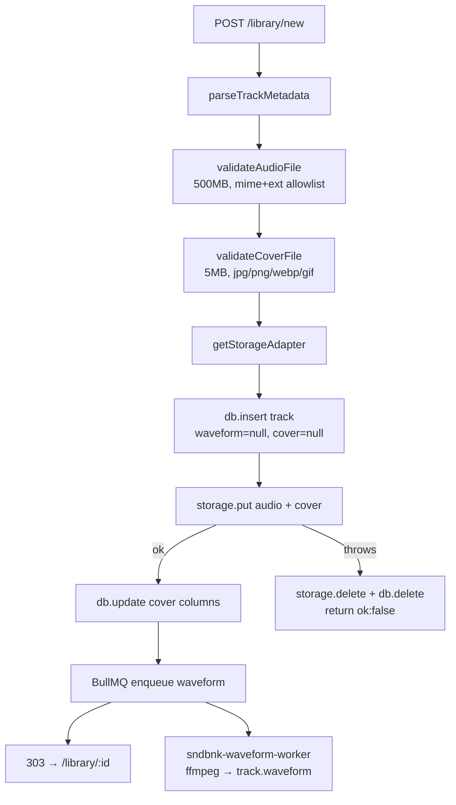

# Media and storage

Every creator picks where their audio lives: SNDBNK's disk, or their own server over SFTP. The app
talks to both through one narrow interface, and the choice is recorded per track so switching later
never orphans anything.

## The adapter interface

Declared as a JSDoc typedef in [`src/lib/server/storage/types.js`](../src/lib/server/storage/types.js),
with no runtime class or base implementation:

```js
/**
 * @typedef {Object} StorageAdapter
 * @property {StorageAdapterKind} id
 * @property {(folderKey, filename, data, contentType) => Promise<void>} put
 * @property {(folderKey, filename) => Promise<StorageObject>} get
 * @property {(folderKey) => Promise<void>} delete
 * @property {() => Promise<{ ok: true } | { ok: false, message: string }>} testConnection
 */
```

Four methods. No `list`, no `exists`, no `copy` — add one only when a feature actually needs it.

`get()` returns `{ body, contentType, size }` where `body` is `Uint8Array | ReadableStream | Blob`.
Callers must handle all three: local returns a lazy `Bun.file` Blob, SSH returns a `Uint8Array`. The
two existing normalizers to copy are `toBytes()` in `embed-tags.js` and `sliceBody()` in the media
route.

### Implementations

| Adapter    | Factory                            | Notes                                                               |
| ---------- | ---------------------------------- | ------------------------------------------------------------------- |
| `local`    | `createLocalAdapter(userId)`       | `Bun.write` / `Bun.file` under `MEDIA_ROOT`                         |
| `ssh`      | `createSshAdapter(userId, config)` | `ssh2` SFTP, a fresh connection per operation                       |
| `s3`, `r2` | —                                  | listed in `STORAGE_ADAPTERS` with `enabled: false`; not implemented |

Layout is identical across adapters, which is what makes them interchangeable:

```
{MEDIA_ROOT or sshRemotePath}/{userId}/{folderKey}/{filename}
```

`folderKey` is the track id, so a track's files are one directory and `delete(folderKey)` is a
complete cleanup.

### Resolving an adapter

```js
// Writing a new track: use the owner's current preference
const storage = await getStorageAdapter(userId, adapterId);

// Reading an existing track: use the adapter it was uploaded with
const adapter = await getStorageAdapter(row.userId, row.storageAdapter);
```

Always pass `row.storageAdapter` on reads. Omitting it silently looks in the wrong place for any
creator who has since changed their setting.

`getOrCreateStorageSetting()` inserts a default `local` row on first access, so no caller handles a
missing setting.

## Credential encryption

SSH private keys and passphrases are AES-256-GCM encrypted before they touch the database
([`storage/crypto.js`](../src/lib/server/storage/crypto.js)):

- key = `sha256(STORAGE_SECRET)`
- payload = `base64(iv ‖ authTag ‖ ciphertext)`, 12-byte IV, 16-byte tag
- `decryptSecret()` throws on a malformed payload rather than returning garbage

Two rules follow:

1. **Decrypted secrets never leave the storage layer.** `sshConfigFromRow()` decrypts privately and
   hands the config straight to `createSshAdapter`. Anything user-facing goes through
   `getStorageSettingPublic()`, which reports `hasPrivateKey: Boolean(row.sshPrivateKeyEnc)` and
   never the value.
2. **Rotating `STORAGE_SECRET` invalidates every stored credential.** There is no key-versioning
   scheme; users would have to re-enter their keys.

## Upload pipeline



The ordering is deliberate: the DB row is written **first** so the generated `id` can be the
`folderKey`, and a storage failure rolls back both the files and the row. Cover columns stay null
until after a successful cover put so feed/library do not request `/cover` while bytes are still
landing. Preserve that shape if you add another storage step — the rollback is the only thing
standing between a failed upload and an orphaned row. Waveform jobs are enqueued **after** a
successful put; enqueue failure is fail-soft (upload still succeeds, peaks stay placeholders until a
later backfill).

Validation limits live at the top of [`tracks.js`](../src/lib/server/tracks.js):
`AUDIO_MAX_BYTES` 500MB, `COVER_MAX_BYTES` 5MB, with a MIME-plus-extension allowlist rather than
trusting the browser's `Content-Type` alone.

Those limits are only reachable if `BODY_SIZE_LIMIT` is above them. `svelte-adapter-bun` defaults to
512K and answers `413` before any app code runs, so raising an app-side limit means raising that env
var too — see [operations.md](operations.md). Use `520M` to cover 500MB audio + 5MB cover + form
overhead.

Client-side, [`audio-metadata.js`](../src/lib/media/audio-metadata.js) probes the file with
`music-metadata` before submit and posts duration, bitrate, sample rate, channels, and codec as
hidden fields. Because that data is client-supplied it is treated as untrusted: `optionalBoundedInt`
silently drops anything out of range instead of failing the upload.

## Waveforms

Peak generation runs in a **BullMQ worker** (`bun run worker:waveform`), not inside the upload
request. That keeps long DJ mixes from blocking the single HTTP process.

`generateWaveformPeaksFromPath()` shells out to ffmpeg via `Bun.spawn`, streaming 4 kHz mono 16-bit
PCM into a coarse ~1 peak/sec envelope, then downsampling to `WAVEFORM_BUCKETS` (1000)
max-amplitude buckets (or fewer for very short files), normalizing against the loudest bucket, and
quantizing to integers 0–100. The result is stored as a JSON string on `track.waveform` (~2–3 KB),
so a profile page ships peaks inline with no extra request. Local-adapter jobs point ffmpeg at the
file under `MEDIA_ROOT`; SSH tracks are staged to a temp file first.

Redis + worker pieces:

| Piece                                                      | Role                                                          |
| ---------------------------------------------------------- | ------------------------------------------------------------- |
| `REDIS_URL`                                                | optional; when unset, enqueue is a no-op (uploads still work) |
| [`queue/waveform.js`](../src/lib/server/queue/waveform.js) | `enqueueWaveformJob` / `processWaveformJob`                   |
| `scripts/waveform-worker.js`                               | BullMQ `Worker`, concurrency 1                                |
| `systemd.waveform-worker.service`                          | production unit beside `sndbnk.service`                       |

Things to know:

- **ffmpeg is required for real waveforms.** Production deploy installs and checks for it. Every
  failure path still leaves `waveform` null (uploads never break on a decode miss). Failures log
  `[waveform]` / `[waveform-worker]` lines — check `journalctl -u sndbnk-waveform-worker` as well as
  `sndbnk`. The UI falls back to placeholder bars until peaks land.
- **`ensureTrackWaveform(row)` only enqueues.** It never runs ffmpeg on the request path. Missing
  peaks trigger a deduped BullMQ job (`jobId = trackId`); the caller keeps seeing placeholders until
  the next load after the worker finishes.
- **Worker timeout** is 15 minutes so multi-hour mixes can finish decoding at 4 kHz.

`Waveform.svelte` divides the stored 0–100 ints by 100 for wavesurfer, and falls back to a synthetic
sine pattern when peaks are `null`.

## Tag embedding

`embedTrackTags(userId, trackId)` writes the track's saved metadata into the audio file itself with
`taglib-wasm`, so a downloaded file carries its tags. It is the most defensive code in the repo, and
intentionally so:

- **Non-destructive.** A field is written only if the file's existing tag is blank
  (`isBlankTag(before[readKey])`).
- **Verified after save.** The updated bytes are reopened and compared against the pre-write property
  map. If any previously non-blank tag went missing or got replaced, the whole operation aborts with
  `{ ok: false }` and nothing is uploaded.
- **Format-aware.** `TAG_FIELDS` carries a separate `writeKey` and `readKey` per field because
  TagLib returns properties under different keys than it accepts. `DESCRIPTION` is not modelled
  natively and aliases `COMMENT` on Vorbis formats, which is why it only lands when there is no
  comment.
- **Single initialization.** `taglibPromise ??= TagLib.initialize()` — the WASM module is
  initialized once per process.
- Files are always `dispose()`d in `finally`, and `track.audioBytes` is updated after a successful
  `storage.put` since the file size changed.

## Serving media

`/api/media/[id]/[file]` where `file` is `audio` or `cover`:

- **Public, no session check.** Tracks must play from public profiles, and that is documented inline
  at the check site.
- Sets `accept-ranges: bytes`. Published covers use `cache-control: public, max-age=3600`; audio and
  unpublished owner previews stay `private, max-age=3600`.
- Parses a single `Range: bytes=a-b` header (including suffix ranges) and answers `206` with
  `content-range`. `sliceBody()` uses `Blob.slice` for local files, so seeking never reads the whole
  file off disk.
- `storage.get` is tried up to three times with short backoff for transient failures (SSH connect
  blips). Clear missing-file errors (`File not found.`, SFTP/ENOENT) are not retried.
- Any failure — bad `file` param, missing track, storage error after retries — is a flat `404` with
  `cache-control: private, no-store` so intermediaries do not sticky-cache a transient miss. It
  deliberately does not distinguish "no such track" from "storage down" to the client.

Cover `` tags go through `#lib/components/CoverArt.svelte`, which uses native `loading` /
`decoding="async"`, retries failed loads with a `?r=` cache-bust (up to three attempts), then falls
back to a placeholder. Upload inserts the track row before `storage.put` (folderKey = id) but leaves
`coverFilename` null until the cover bytes are stored, so listings do not advertise `hasCover`
during the put window.

The player points an `HTMLAudioElement` at this URL and lets the browser do the ranged fetching:
`el.src = /api/media/${track.id}/audio`.
