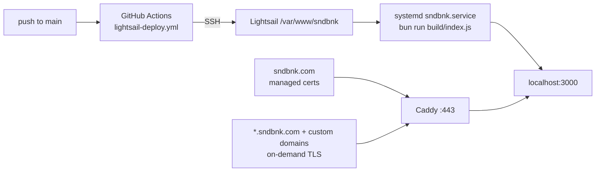

# Operations

## Local development

```sh
cp .env.example .env    # then fill BETTER_AUTH_SECRET and STORAGE_SECRET
bun install
bun run db:push
bun run dev             # http://localhost:5173
```

Optional but useful: install `ffmpeg` so uploads get real waveforms instead of placeholder bars.

### Testing tenant hosts locally

With `PUBLIC_BASE_DOMAIN=localhost`:

- apex surfaces (`/`, `/signin`, `/signup`, `/settings`, `/library`) → `http://localhost:5173`
- a premium profile → `http://{username}.localhost:5173` (browsers resolve `*.localhost` to
  loopback with no hosts-file entry)
- a custom domain → add a `127.0.0.1` hosts entry and verify the domain in Settings first;
  `vite.config.js` sets `server.allowedHosts: true` specifically so arbitrary `Host` headers reach
  the tenant hook

A basic-plan user on a subdomain is redirected to the apex path URL, which is the fastest way to
confirm plan gating works.

## Environment variables

Registered in [`src/env.js`](../src/env.js) and read through `$app/env/private` /
`$app/env/public`. Anything not in that registry is invisible to the app.

| Variable             | Visibility | Dev                     | Prod                 | Purpose                                                                 |
| -------------------- | ---------- | ----------------------- | -------------------- | ----------------------------------------------------------------------- |
| `DATABASE_URL`       | private    | `local.db`              | `local.db`           | SQLite **file path**, not a URL                                         |
| `ORIGIN`             | private    | `http://localhost:5173` | `https://sndbnk.com` | better-auth `baseURL`; must match the browser origin exactly            |
| `PUBLIC_BASE_DOMAIN` | **public** | `localhost`             | `sndbnk.com`         | apex hostname for tenant classification                                 |
| `BETTER_AUTH_SECRET` | private    | any                     | 32+ chars            | signs sessions; changing it logs everyone out                           |
| `MEDIA_ROOT`         | private    | `./media`               | `./media`            | local upload root                                                       |
| `STORAGE_SECRET`     | private    | any                     | 32+ chars            | encrypts BYOS credentials; changing it invalidates every stored SSH key |
| `PROTOCOL_HEADER`    | adapter    | unset                   | `X-Forwarded-Proto`  | lets the Bun adapter rebuild URLs behind Caddy                          |
| `HOST_HEADER`        | adapter    | unset                   | `X-Forwarded-Host`   | same                                                                    |

`PROTOCOL_HEADER` and `HOST_HEADER` are read by `svelte-adapter-bun` itself, not by `src/env.js`.
Without them the app sees `http://localhost:3000` as its origin and better-auth rejects sign-ins with
`INVALID_ORIGIN` — that is the single most likely cause of "login works locally, fails in prod".

**`.env` is currently committed to the repo** with live secrets, as a temporary deploy workaround.
See [known-issues.md](known-issues.md).

## Production topology



### Deploy

`.github/workflows/lightsail-deploy.yml` triggers on push to `main` and runs one SSH script. Secrets:
`LIGHTSAIL_HOST`, `LIGHTSAIL_USERNAME`, `LIGHTSAIL_SSH_KEY`, `LIGHTSAIL_PORT`.

Steps, in order:

1. Put Bun on `PATH` explicitly — a non-interactive SSH session does not load shell rc files.
2. Snapshot the existing `.env`, `git pull --ff-only origin main`, then run a Python script that
   merges it back: `BETTER_AUTH_SECRET`, `STORAGE_SECRET`, `DATABASE_URL`, and `MEDIA_ROOT` are
   preserved from the live server, while `ORIGIN`, `PUBLIC_BASE_DOMAIN`, `PROTOCOL_HEADER`, and
   `HOST_HEADER` are forced to their production values. Missing secrets are generated.
3. Fix ownership and permissions on the SQLite file **and its `-wal` / `-shm` / `-journal`
   sidecars** — SQLite needs write access to all of them, and getting this wrong produces
   read-only-database errors at runtime.
4. Copy `systemd.service` from the repo to `/etc/systemd/system/sndbnk.service`, `daemon-reload`.
5. `bun install`, source `.env`, `bun run db:push`, `bun run build`.
6. `systemctl restart sndbnk`, confirm `is-active`.
7. Smoke-test auth: POST a bogus credential to `http://127.0.0.1:3000/api/auth/sign-in/email` with
   `origin: https://sndbnk.com`. A `400`/`401` means the origin was accepted and the deploy passes.
   A `403 INVALID_ORIGIN` or a `500` fails the job and dumps `journalctl -u sndbnk -n 50`.

That last step is the reason production auth regressions get caught by CI rather than by users.

### The service

[`systemd.service`](../systemd.service) runs as `ubuntu` from `/var/www/sndbnk`,
`ExecStart=/home/ubuntu/.bun/bin/bun run build/index.js`, `Restart=always`, and
`EnvironmentFile=-/var/www/sndbnk/.env` (Bun also auto-loads `.env`; the `EnvironmentFile` makes the
values visible to non-Bun helpers).

Useful commands on the box:

```sh
sudo systemctl status sndbnk
sudo journalctl -u sndbnk -n 100 -f
sudo systemctl restart sndbnk
```

### Caddy

[`Caddyfile`](../Caddyfile) defines four blocks:

| Block                | Behavior                                                                       |
| -------------------- | ------------------------------------------------------------------------------ |
| global               | `on_demand_tls { ask http://127.0.0.1:3000/api/domain-tls-check }`             |
| `www.sndbnk.com`     | permanent redirect to the apex                                                 |
| `sndbnk.com`         | managed certs, gzip/zstd, security headers, `reverse_proxy localhost:3000`     |
| `https://` catch-all | `tls { on_demand }`, same proxy — serves premium subdomains and custom domains |

All proxied requests get `X-Real-IP`, `X-Forwarded-Proto`, and `X-Forwarded-Host`. The tenant hook
reads `x-forwarded-host`, so this header is load-bearing, not cosmetic.

Security headers set on both site blocks: HSTS, `X-Content-Type-Options: nosniff`,
`X-Frame-Options: DENY`, `Referrer-Policy: strict-origin-when-cross-origin`, a restrictive
`Permissions-Policy`, and `-Server`.

### On-demand TLS gate

Caddy will only mint a certificate for a hostname when
[`/api/domain-tls-check`](../src/routes/api/domain-tls-check/+server.js) returns `200`. It returns
`200` only for:

- `{username}.{PUBLIC_BASE_DOMAIN}` where that username exists and is on `premium`
- a custom hostname that matches `profile.customDomain` exactly, is `premium`, and has
  `customDomainStatus === 'active'`

Everything else — including the apex, which uses managed certs — gets `400`. Without this gate,
pointing any domain at the server would let it obtain a certificate.

DNS requirements: `sndbnk.com` and `*.sndbnk.com` A records at the server; a creator's custom domain
CNAMEs to `{username}.sndbnk.com` after verification.

## Troubleshooting

| Symptom                                                  | Likely cause                                                                                                      |
| -------------------------------------------------------- | ----------------------------------------------------------------------------------------------------------------- |
| Sign-in returns `403 INVALID_ORIGIN` in prod             | `ORIGIN` mismatch, or `PROTOCOL_HEADER`/`HOST_HEADER` missing so the adapter reports `localhost:3000`             |
| `SQLITE_READONLY` / attempt to write a readonly database | ownership or mode on the db file or its `-wal`/`-shm` sidecars                                                    |
| Cookies do not persist across a subdomain                | `crossSubDomainCookies` is disabled when `PUBLIC_BASE_DOMAIN` is `localhost`, enabled otherwise — check the value |
| Tenant host returns 404                                  | profile missing, plan is not `premium`, or `customDomainStatus` is not `active`                                   |
| Custom domain will not get TLS                           | `/api/domain-tls-check?domain=…` is returning `400`; hit it directly to see which check fails                     |
| Waveforms are flat placeholder bars                      | `ffmpeg` not installed on the host                                                                                |
| Likes or comments 500 in prod                            | schema drift — see [known-issues.md](known-issues.md)                                                             |
| `bun run build` fails on `bun:sqlite`                    | something is running under Node; every command must go through Bun                                                |

`.github/workflows/prod-auth-diagnose.yml` is a manually dispatchable diagnostic that probes env,
permissions, systemd, the build, and both the API and public HTTPS surfaces. It is marked temporary
but is the fastest way to inspect a broken production box.

## Repo hygiene

- `scratch-seed.js` and `scratch-verify.js` at the repo root are one-off probes from the tag-embedding
  work, with hardcoded `/tmp` paths. They are committed but wired to nothing. Do not build on them.
- `bun run lint` is `prettier --check .`, which covers markdown and CSS too. There is no ESLint and
  no test runner in this project.
