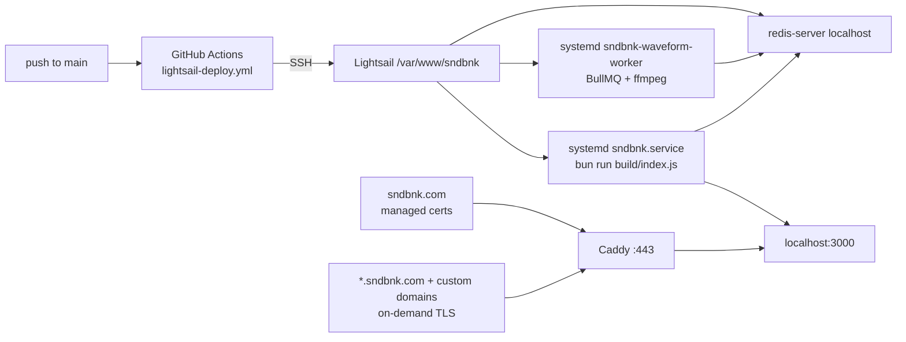

# Operations

## Local development

```sh
cp .env.example .env    # then fill BETTER_AUTH_SECRET and STORAGE_SECRET
bun install
bun run db:migrate
bun run dev             # http://localhost:5173
```

Install `ffmpeg` with `libmp3lame` too. Uploads shell out to it for waveform peaks and WAV→MP3
playback copies; without it, tracks get placeholder bars and WAV uploads keep streaming as WAV.
Production deploy installs and verifies ffmpeg before restarting the service.

### Testing tenant hosts locally

With `PUBLIC_BASE_DOMAIN=localhost`:

- apex surfaces (`/`, `/signin`, `/signup`, `/settings`, `/library`) → `http://localhost:5173`
- a Vault+ profile → `http://{username}.localhost:5173` (browsers resolve `*.localhost` to
  loopback with no hosts-file entry)
- a custom domain → add a `127.0.0.1` hosts entry and verify the domain in Settings first;
  `vite.config.js` sets `server.allowedHosts: true` specifically so arbitrary `Host` headers reach
  the tenant hook

A Free-plan user on a subdomain is redirected to the apex path URL, which is the fastest way to
confirm plan gating works.

### Full local reset (`bun run nuke`)

Wipes app data and re-initializes a fresh empty database (schema + plan seeds):

- deletes `DATABASE_URL` and its `-wal` / `-shm` / `-journal` sidecars
- deletes `MEDIA_ROOT` (recreates an empty directory)
- deletes the DB backups directory (`BACKUP_DIR`, default `<db-dir>/backups`)
- runs `bun run db:migrate`

Interactive confirmation requires typing `nuke`. Non-interactive shells need
`NUKE_CONFIRM=nuke`. If `ORIGIN` is not localhost (or the DB path is under `/var/www/`), a second
phrase is required: type `reset production`, or set `NUKE_PRODUCTION=reset production`. Does not
touch `.env`, source, or `drizzle/` migration files. Afterward you may want
`bun run createsuperuser`.

## Environment variables

Registered in [`src/env.js`](../src/env.js) and read through `$app/env/private` /
`$app/env/public`. Anything not in that registry is invisible to the app.

| Variable             | Visibility | Dev                     | Prod                     | Purpose                                                                 |
| -------------------- | ---------- | ----------------------- | ------------------------ | ----------------------------------------------------------------------- |
| `DATABASE_URL`       | private    | `local.db`              | `local.db`               | SQLite **file path**, not a URL                                         |
| `ORIGIN`             | private    | `http://localhost:5173` | `https://sndbnk.com`     | better-auth `baseURL`; must match the browser origin exactly            |
| `PUBLIC_BASE_DOMAIN` | **public** | `localhost`             | `sndbnk.com`             | apex hostname for tenant classification                                 |
| `BETTER_AUTH_SECRET` | private    | any                     | 32+ chars                | signs sessions; changing it logs everyone out                           |
| `MEDIA_ROOT`         | private    | `./media`               | `./media`                | local upload root                                                       |
| `BODY_SIZE_LIMIT`    | private    | `520M`                  | `520M`                   | max request body; the adapter default of 512K rejects uploads           |
| `STORAGE_SECRET`     | private    | any                     | 32+ chars                | encrypts BYOS credentials; changing it invalidates every stored SSH key |
| `REDIS_URL`          | private    | optional                | `redis://127.0.0.1:6379` | BullMQ waveform jobs; leave empty to skip async peaks                   |
| `PROTOCOL_HEADER`    | adapter    | unset                   | `X-Forwarded-Proto`      | lets the Bun adapter rebuild URLs behind Caddy                          |
| `HOST_HEADER`        | adapter    | unset                   | `X-Forwarded-Host`       | same                                                                    |

**Every variable in `src/env.js` is required** unless it declares a validator saying otherwise. A
`.env` missing one makes the app return 500 on _every_ route at boot, not just on the feature that
needs it. If your checkout predates a variable, copy it from `.env.example`.

`PROTOCOL_HEADER` and `HOST_HEADER` are read by `svelte-adapter-bun` itself, not by `src/env.js`.
Without them the app sees `http://localhost:3000` as its origin and better-auth rejects sign-ins with
`INVALID_ORIGIN` — that is the single most likely cause of "login works locally, fails in prod".

`BODY_SIZE_LIMIT` must exceed the app's own ceilings (500MB audio + 5MB cover + form overhead), or the
adapter answers `413` before `validateAudioFile()` ever runs — which presents as a broken upload form
rather than a size rejection. Production deploy raises the floor to `520M` when the value is missing
or too small.

`REDIS_URL` is optional in `src/env.js` so older `.env` files still boot. Without it (or without the
waveform worker), uploads succeed but tracks keep placeholder waveforms until Redis +
`sndbnk-waveform-worker` are running and a page view re-enqueues backfill.

`.env` is gitignored and instance-local. Copy from `.env.example` for new checkouts; production
deploy snapshots and restores the server file across `git pull`, then merges managed keys. Older
commits still contain former secret values — see [known-issues.md](known-issues.md).

## Production topology



### Deploy

`.github/workflows/lightsail-deploy.yml` triggers on push to `main` and runs one SSH script. Secrets:
`LIGHTSAIL_HOST`, `LIGHTSAIL_USERNAME`, `LIGHTSAIL_SSH_KEY`, `LIGHTSAIL_PORT`.

Steps, in order:

1. Put Bun on `PATH` explicitly — a non-interactive SSH session does not load shell rc files.
2. Snapshot the existing `.env`, clear any formerly-tracked dirt so pull can ff, restore the
   snapshot after `git pull --ff-only origin main` (so git never deletes instance secrets), then
   run a Python script that merges managed keys: `BETTER_AUTH_SECRET`, `STORAGE_SECRET`,
   `DATABASE_URL`, and `MEDIA_ROOT` are preserved from the live server, while `ORIGIN`,
   `PUBLIC_BASE_DOMAIN`, `PROTOCOL_HEADER`, and `HOST_HEADER` are forced to their production
   values. Missing secrets are generated, and `BODY_SIZE_LIMIT` is raised to `520M` if it is
   absent or parses below that. `REDIS_URL` is preserved when set, otherwise defaulted to
   `redis://127.0.0.1:6379`.
3. Fix ownership and permissions on the SQLite file **and its `-wal` / `-shm` / `-journal`
   sidecars** — SQLite needs write access to all of them, and getting this wrong produces
   read-only-database errors at runtime.
4. Copy `systemd.service` and `systemd.waveform-worker.service` from the repo into
   `/etc/systemd/system/`, `daemon-reload`, enable both units.
5. Ensure `redis-server` and `ffmpeg` are on PATH (install via apt if missing); fail the deploy if
   ffmpeg is still absent.
6. `bun install`, source `.env`, `bun run db:backup` (when the SQLite file exists),
   `bun run db:migrate` (Drizzle SQL under `drizzle/` via the Bun migrator), `bun run build`.
7. `systemctl restart sndbnk sndbnk-waveform-worker`, confirm both `is-active`.
8. Smoke-test auth: POST a bogus credential to `http://127.0.0.1:3000/api/auth/sign-in/email` with
   `origin: https://sndbnk.com`. A `400`/`401` means the origin was accepted and the deploy passes.
   A `403 INVALID_ORIGIN` or a `500` fails the job and dumps `journalctl -u sndbnk -n 50`.

That last step is the reason production auth regressions get caught by CI rather than by users.

### The service

[`systemd.service`](../systemd.service) runs as `ubuntu` from `/var/www/sndbnk`,
`ExecStart=/home/ubuntu/.bun/bin/bun run build/index.js`, `Restart=always`,
`HOST=127.0.0.1` / `PORT=3000` (loopback-only so clients cannot forge `X-Forwarded-Host` against the
app port), and `EnvironmentFile=-/var/www/sndbnk/.env` (Bun also auto-loads `.env`; the
`EnvironmentFile` makes the values visible to non-Bun helpers).

[`systemd.waveform-worker.service`](../systemd.waveform-worker.service) runs the BullMQ consumer
(`bun ./scripts/waveform-worker.js`) with concurrency 1 so one long mix cannot pile up ffmpeg on the
box. It wants `redis-server.service`.

Useful commands on the box:

```sh
sudo systemctl status sndbnk sndbnk-waveform-worker redis-server
sudo journalctl -u sndbnk -n 100 -f
sudo journalctl -u sndbnk-waveform-worker -n 50 --no-pager
sudo systemctl restart sndbnk sndbnk-waveform-worker
```

### Redis (Ubuntu / Lightsail)

One-time (or via deploy) on the app host — bind localhost only:

```sh
sudo apt-get update
sudo DEBIAN_FRONTEND=noninteractive apt-get install -y redis-server
# ensure bind 127.0.0.1 ::1 in /etc/redis/redis.conf (Ubuntu default)
sudo systemctl enable --now redis-server
redis-cli ping   # PONG
```

App `.env` on the server:

```sh
BODY_SIZE_LIMIT=520M
REDIS_URL=redis://127.0.0.1:6379
```

Locally: `brew install redis && brew services start redis` (or Docker), then set the same
`REDIS_URL` and run `bun run worker:waveform` in a second terminal beside `bun run dev`. The worker
reads config from `process.env` via [`app-env.js`](../src/lib/server/app-env.js) so it can share
storage/DB modules without SvelteKit’s `$app/env` virtual modules.

### Caddy

`/etc/caddy/Caddyfile` is a symlink to the repo `Caddyfile`. Deploy ensures
`/var/log/caddy/sndbnk-tenant.access.log` exists and is owned by `caddy`, then
`systemctl reload caddy` — without that log file, reload fails and the running
process keeps a stale config (subdomains then fail TLS with
`ERR_SSL_PROTOCOL_ERROR` even when DNS and `/api/domain-tls-check` are fine).

[`Caddyfile`](../Caddyfile) defines four blocks:

| Block                | Behavior                                                                        |
| -------------------- | ------------------------------------------------------------------------------- |
| global               | `on_demand_tls { ask http://127.0.0.1:3000/api/domain-tls-check }`              |
| `www.sndbnk.com`     | permanent redirect to the apex                                                  |
| `sndbnk.com`         | managed certs, gzip/zstd, security headers, `reverse_proxy localhost:3000`      |
| `https://` catch-all | `tls { on_demand }`, same proxy — serves entitled subdomains and custom domains |

All proxied requests get `X-Real-IP`, `X-Forwarded-Proto`, and `X-Forwarded-Host`. The tenant hook
reads `x-forwarded-host`, so this header is load-bearing, not cosmetic.

Security headers set on both site blocks: HSTS, `X-Content-Type-Options: nosniff`,
`X-Frame-Options: DENY`, `Referrer-Policy: strict-origin-when-cross-origin`, a restrictive
`Permissions-Policy`, `Content-Security-Policy-Report-Only` (not enforcing — see
[known-issues](known-issues.md)), and `-Server`. The SvelteKit `handle` sequence also sets the same
baseline headers (minus HSTS) so dev / direct Bun is not naked.

### On-demand TLS gate

Caddy will only mint a certificate for a hostname when
[`/api/domain-tls-check`](../src/routes/api/domain-tls-check/+server.js) returns `200`. The handler
accepts **loopback asks only** (Caddy’s `ask http://127.0.0.1:3000/...`); public probes get `404`.
It returns `200` only for:

- `{username}.{PUBLIC_BASE_DOMAIN}` where that username exists and `canUseSubdomain(plan)` (Vault+)
- a custom hostname that matches `profile.customDomain` exactly, `canUseCustomDomain(plan)` (Studio+),
  and `customDomainStatus === 'active'`

Everything else — including the apex, which uses managed certs — gets `400`. Without this gate,
pointing any domain at the server would let it obtain a certificate.

### Security hardening (app)

- **Tenant isolation:** subdomain / custom-domain hosts only serve that creator’s tracks, playlists,
  and profile APIs. Apex discovery stays global.
- **Auth abuse:** in-memory rate limits on sign-in / signup / password reset / anonymous checkout
  signup; better-auth `disabledPaths` closes public `/sign-up/email` and unused admin HTTP routes
  (impersonation, create/remove user, set password).
- **Uploads:** magic-byte sniffing for audio/images; SSH BYOS rejects private / link-local /
  metadata targets; storage adapters refuse path-escaping segments; ffmpeg waveform extraction runs
  in a BullMQ worker with a long timeout and streams PCM (no full-decode memory cap).
- **Mutating JSON APIs:** require a same-site / allowed `Origin` (or `Sec-Fetch-Site`).

DNS requirements (platform, Route 53 hosted zone for `sndbnk.com`):

| Record           | Type              | Value               | Why                                                                                       |
| ---------------- | ----------------- | ------------------- | ----------------------------------------------------------------------------------------- |
| `sndbnk.com`     | A                 | Lightsail public IP | Apex app                                                                                  |
| `www.sndbnk.com` | A (or CNAME→apex) | same IP             | Redirect target in Caddy                                                                  |
| `*.sndbnk.com`   | A                 | same IP             | **Required** for every `{username}.sndbnk.com` and as the CNAME target for custom domains |

Without the wildcard, subdomain hosts do not resolve at all — the app and `/api/domain-tls-check`
can be healthy while browsers still fail with `NXDOMAIN`. Deploy smoke-tests a probe name under the
wildcard after restart.

Creator custom domains (after Studio+ verification):

- **Ownership:** TXT at `_sndbnk-verify.{domain}` (or the root) with the token from Settings.
- **Routing:** CNAME to `{username}.sndbnk.com`, **or** A/AAAA (or provider ALIAS/ANAME) to the same
  addresses as the platform edge. Apex zones cannot use CNAME; A/AAAA/ALIAS is the supported path.
- Verification is in [`domain-verify.js`](../src/lib/server/domain-verify.js); Caddy still gates TLS
  via `/api/domain-tls-check` so only `active` custom domains mint certs.

## Troubleshooting

| Symptom                                                   | Likely cause                                                                                                                            |
| --------------------------------------------------------- | --------------------------------------------------------------------------------------------------------------------------------------- |
| Every route 500s with `Invalid environment variables`     | your `.env` predates a variable added to `src/env.js`; copy it from `.env.example`                                                      |
| Sign-in returns `403 INVALID_ORIGIN` in prod              | `ORIGIN` mismatch, or `PROTOCOL_HEADER`/`HOST_HEADER` missing so the adapter reports `localhost:3000`                                   |
| `SQLITE_READONLY` / attempt to write a readonly database  | ownership or mode on the db file or its `-wal`/`-shm` sidecars                                                                          |
| Cookies do not persist across a subdomain                 | `crossSubDomainCookies` is disabled when `PUBLIC_BASE_DOMAIN` is `localhost`, enabled otherwise — check the value                       |
| Tenant host returns 404                                   | profile missing, plan lacks subdomain/custom-domain entitlement, or `customDomainStatus` is not `active`                                |
| `{user}.sndbnk.com` does not resolve                      | missing `*.sndbnk.com` A record in Route 53 — add it pointing at the Lightsail IP                                                       |
| Custom domain verify fails on apex                        | use A/AAAA (or ALIAS) to the platform IPs shown in Settings, not a CNAME                                                                |
| Custom domain will not get TLS                            | `/api/domain-tls-check?domain=…` is returning `400`; hit it directly to see which check fails                                           |
| Waveforms are flat placeholder bars                       | Redis/worker/ffmpeg — check `REDIS_URL`, `systemctl status sndbnk-waveform-worker redis-server`, `journalctl -u sndbnk-waveform-worker` |
| Upload returns `413` before any validation message        | `BODY_SIZE_LIMIT` too low or unset; the adapter defaults to 512K (need ≥ `520M`)                                                        |
| A query fails on a column that exists in `schema.js`      | the column was added to `schema.js` but no migration was generated/applied — run `bun run db:generate` + `db:migrate`                   |
| `bun run build` fails on `bun:sqlite`                     | something is running under Node; every command must go through Bun                                                                      |
| Build prints `[UNRESOLVED_IMPORT] bun:sqlite` then ✔ done | cosmetic: `svelte-adapter-bun`’s Rolldown pass externalizes it for the Bun runtime; not a deploy failure                                |
| Deploy fails with worker `activating` / exit code 3       | `sndbnk-waveform-worker` crash-loop — check `journalctl -u sndbnk-waveform-worker` (often Bun `#lib/…` import resolution)               |

`.github/workflows/prod-auth-diagnose.yml` is a manually dispatchable diagnostic that probes env,
permissions, systemd, the build, and both the API and public HTTPS surfaces. It is marked temporary
but is the fastest way to inspect a broken production box.

## Repo hygiene

- `scratch-seed.js` and `scratch-verify.js` at the repo root are one-off probes from the tag-embedding
  work, with hardcoded `/tmp` paths. They are committed but wired to nothing. Do not build on them.
- `bun run lint` is `prettier --check .`, which covers markdown and CSS too. There is no ESLint and
  no test runner in this project.
