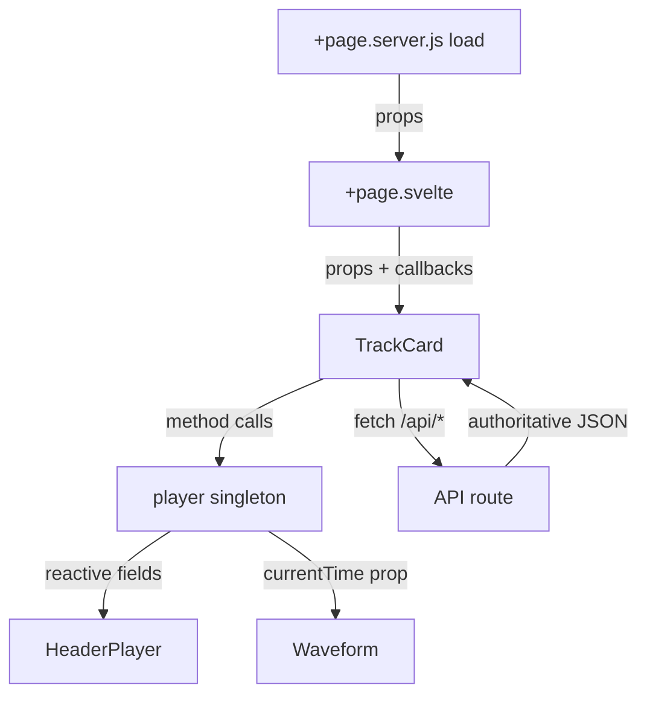

# Reactivity

Svelte 5 runes, everywhere, with no legacy holdovers in components. There is not a single
`export let`, `on:click`, `createEventDispatcher`, or `$:` in the codebase — and adding one would be
a regression. This document is the pattern catalogue.

## The one rule

**Derive state; do not synchronize it.** If a value can be computed from other values, it is a
`$derived`. Reach for `$effect` only when you have to push a value into something outside Svelte's
reach: a canvas, an `<audio>` element, `localStorage`, a third-party library.

Every `$effect` in this codebase is on that boundary. Keep it that way.

## Props

Destructure once, with defaults inline, typed by a JSDoc object literal above the call:

```js
/**
 * @type {{
 *   peaks: number[] | null,
 *   durationMs: number | null,
 *   currentTime?: number,
 *   height?: number,
 *   onseek?: (seconds: number) => void
 * }}
 */
let { peaks, durationMs, currentTime = 0, height = 66, onseek } = $props();
```

- **Never copy a prop into `$state`.** That breaks the reactive link and is the single most common
  runes mistake. If you need a derived view of a prop, use `$derived`. If you need editable local
  state seeded from a prop, that is a form field — see the override pattern below.
- **Callback props, not events.** `onseek`, `oncommented`, `ondeleted`, called optionally:
  `onseek?.(newTime)`. There is no `createEventDispatcher` anywhere, and `$bindable` is unused —
  parents own the state and pass callbacks down.
- **Reuse markup with snippets**, not with a wrapper component:

```svelte
{#snippet navLinks()}
	<a href="/library" aria-current={current('/library')}>Library</a>
{/snippet}

<nav class="desktop">{@render navLinks()}</nav>
<nav class="mobile">{@render navLinks()}</nav>
```

## Local state and derivations

Declare `$state` for what the user changes, and `$derived` for everything downstream. From
`TrackCard.svelte`:

```js
const isActive = $derived(player.isCurrent(track.id));
const isPlaying = $derived(isActive && player.playing);
const cardTime = $derived(isActive ? player.currentTime : 0);
const durationSec = $derived((track.durationMs ?? 0) / 1000);
const progressPct = $derived(durationSec > 0 ? Math.min((cardTime / durationSec) * 100, 100) : 0);
```

Five derivations, no effects, no manual invalidation — and the card's progress bar tracks a
singleton it does not own. That chain is the house style.

Use `$derived.by(() => { … })` when the expression needs statements. Keep both side-effect free.

## The override pattern for optimistic updates

Server data arrives as props from `load`. An in-place mutation must not fight that. The codebase
holds a nullable **override** beside the prop and derives the display value:

```js
/** @type {{ liked: boolean, count: number } | null} */
let likeOverride = $state(null);
const liked = $derived(likeOverride?.liked ?? track.likedByViewer);
const likeCount = $derived(likeOverride?.count ?? track.likeCount);

async function toggleLike() {
	if (!signedIn || likeBusy) return;
	likeBusy = true;
	try {
		const res = await fetch(`/api/tracks/${track.id}/like`, { method: 'POST' });
		if (res.ok) {
			const data = await res.json();
			likeOverride = { liked: data.liked, count: data.likeCount };
			player.setLiked(track.id, data.liked);
		}
	} finally {
		likeBusy = false;
	}
}
```

Why this rather than mutating `track`:

- `null` means "no local opinion", so a fresh `load` transparently wins
- the override is set from the **server's** response, not a guess, so the UI never drifts
- the `finally` guarantees the busy flag clears

The same shape with a counter delta handles added comments: `extraComments` plus
`const commentCount = $derived(track.commentCount + extraComments)`.

## Shared state: a rune class singleton

Cross-component, cross-navigation state goes in a `.svelte.js` module as a class with `$state`
fields, exported as one instance. [`src/lib/player/player.svelte.js`](../src/lib/player/player.svelte.js)
is the reference implementation:

```js
class Player {
	/** @type {PlayerTrack | null} */
	current = $state(null);
	queue = $state([]);
	playing = $state(false);
	currentTime = $state(0);
	duration = $state(0);

	/** @type {HTMLAudioElement | null} */
	#audio = null;
	#raf = 0;
}

export const player = new Player();
```

What makes it work, and what to copy:

- **Public reactive fields, private machinery.** `#audio`, `#raf`, and `#history` are `#private` and
  deliberately _not_ `$state` — nothing renders from them, so making them reactive would only add
  churn.
- **Methods are the API.** `play()`, `toggle()`, `seek()`, `addToQueue()`, `evict()`. Consumers never
  assign to fields from outside; the invariants live in one file.
- **Reassign, don't mutate, for arrays** — `this.queue = [...this.queue, track]` — which keeps the
  persistence call and the state change adjacent.
- **The DOM element is created lazily and owned by the class.** `#ensureAudio()` builds one `Audio`
  on first use and wires listeners that write back into `$state`. That is why playback survives
  client-side navigation: no component owns the element.
- **`browser` guards at the edges.** The constructor restores the queue only in the browser;
  `#persistQueue()` returns early on the server and swallows storage failures.
- **rAF for the playhead.** `timeupdate` fires ~4×/s, which looks stuttery, so a
  `requestAnimationFrame` loop runs while playing and stops on pause.

Components then just read it — no subscription, no `$` prefix:

```svelte
{#if player.current}
	{@const track = player.current}
```

**New shared state goes here, not in a `writable`.**

## When `$effect` is correct

Syncing a third-party instance is the legitimate case. `Waveform.svelte` holds the wavesurfer
handle in `$state.raw` — the instance is a big mutable object nobody should deep-proxy — and pushes
changes into it:

```js
/** @type {import('wavesurfer.js').default | null} */
let wavesurfer = $state.raw(null);

// Drive the rendered progress from the global player position.
$effect(() => {
	const time = currentTime;
	if (wavesurfer) wavesurfer.setTime(time);
});
```

Notes on that snippet:

- **Read dependencies at the top**, before any branch, so the effect's dependency set does not
  change between runs.
- **One concern per effect.** That file has three: playhead, peaks, theme colors. Merging them would
  re-run color resolution on every animation frame.
- Setup that must happen once — the dynamic `import('wavesurfer.js')`, `WaveSurfer.create()` —
  belongs in `onMount` with a teardown return, not in an effect.
- `$state.raw` for any library instance, DOM handle, or large immutable payload.

**Do not** use `$effect` to derive a value, to keep two pieces of state in step, or to fetch on prop
change. Those are `$derived`, a single source of truth, and `load` respectively.

## Legacy stores

Two modules still use `writable`:

- [`src/lib/stores/theme.js`](../src/lib/stores/theme.js) — `themePreference` and `resolvedTheme`,
  driven by imperative functions (`applyTheme`, `toggleTheme`, `initTheme`) that also touch
  `documentElement` and `localStorage`
- [`src/lib/stores/brand.js`](../src/lib/stores/brand.js) — `accent` (the selected id), `customAccent`
  (the user's hex), and `accentColor`, driven by `applyAccent` / `setAccent` / `setCustomAccent`

They work and they are small, so they are not urgent to change. But they are the old generation:
consumers must remember the `$` prefix, and `Waveform.svelte` mixes `$resolvedTheme` with rune state
in the same file. **New shared state uses a `.svelte.js` rune module.** If you find yourself
substantially editing either store, converting it is in scope.

## Client-side data flow



Server data flows down as props. Playback state flows out of the singleton. Mutations go to an API
route and come back as an override. Nothing reaches sideways into another component's state.
